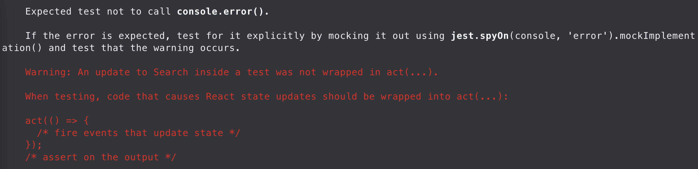

# Тестирование компонентов

### Когда пишем тесты

- **story** - в обязательном порядке всегда пишем тесты, в том числе учитываем корнер кейсы

- **defect** - если дефект вызван ошибками в коде и не связан со стилистическими помарками в html-разметке, то пишем новые или расширяем уже имеющиеся тесты

- **bug** - на усмотрение разработчика. Как правило, наличие бага является прямым следствием недостаточного покрытия кода тестами. Поэтому рекомендуется добавлять новые или расширять уже имеющиеся тесты.

### Как тестируем

- При написании тестов, важно тестировать компоненты с точки зрения пользователя, который будет взаимодействовать со страницей, в том числе и через Screen Reader. [**Подробнее**](#тестирование-компонентов-и-data-testid)

  - При создании html-разметки используйте семантические теги и, при необходимости, `aria-*`, `role` атрибуты
  - Старайтесь минимизировать использование `testId`
  - `aria-*` и `role` атрибуты не являются альтернативой `testId`. Использовать их следует осмысленно, там, где они на самом деле нужны

- Тесты должны быть читабельными и простыми для понимания. [**Подробнее**](#clean-tests)

  - Заголовки тестов начинайте с `Should ...`
  - Отдавайте предпочтение специфичным селекторам
  - Не используйте проверки на css-стили
  - Рефакторите тесты по мере необходимости

- Избегайте использования `act()` в ваших тестах. [**Подробнее**](#страшный-и-ужасный-act)

- При вызове событий используйте `userEvent`, а не `fireEvent`

  - [Отличия `userEvent` от `fireEvent`](https://testing-library.com/docs/user-event/intro/#differences-from-fireevent).
  - Перед `userEvent` всегда указывайте `await` -> `await userEvent.click(...)`

- Учитывайте в тестах негативные сценарии. Если эндпоинт возвращает ошибку, которую мы ожидаем, добавьте на это поведение тесты. Это могут быть проверки на валидационные ошибки, снекбары, попапы, модальные окна и т.д.. Ошибки должны быть контролируемыми.

- Не подключайте в тесты переменные из внешнего кода. Все аргументы должны быть прописаны текстом. Допускается подключать в тесты извне только фикстуры. [**Подробнее**](#фикстуры-и-хэндлеры-msw)

  - Фикстуры для тестов следует создавать и подключать из api-services: `api-services/src/__mocks__`
  - Связывайте ваши фикстуры с интерфейсами ответов эндпоинтов, это повысит надёжность тестов
  - Не модифицируйте напрямую объекты фикстур

- Перед деплоем убедитесь, что на вашей ветке не фейлят тесты. Не пытайтесь протолкнуть их, вызывая множество раз реран джобы. Попросите ваших тестировщиков также этого не делать. [**Подробнее**](#нестабильные-тесты)

  - Если чужие тесты начали фейлить не вашей ветке, не спешите ставить этим тестам `skip`. Проверьте, не могли ли ваши изменения зааффектить тесты. Свяжитесь с командой, которая добавляла тесты и проконсультируйтесь с ней.
  - Если добавляете тестам `skip`, оставьте комментарий с причиной и оповестите об этом команду, которой принадлежат тесты.

- Рекомендуется не хранить все тесты в одном файле. Когда количество тестов приближается к 25-30, разбивайте его на файлы поменьше. Так тесты будут вести себя стабильнее, а пайплайны проходить быстрее.

- Файлы с тестами создавайте в папке `__tests__` рядом с вашим компонентом или в родительской папке (зависит от структуры)

  - Новые файлы с тестами должны быть написаны на typescript. [**Подробнее**](#типизация-тестов)
  - В именах файлов должен присутствовать суффикс `test`: `*.test.ts`

## Тестирование компонентов и `data-testid`

> [The more your tests resemble the way your software is used, the more confidence they can give you.](https://testing-library.com/docs/guiding-principles/)

В процессе написания тестов, мы постоянно сталкиваемся с ситуациями, когда нам нужно получить для проверки тот или иной элемент. Для этих целей у нас есть разные методы и способы. Но их все объединяет одна общая концепция - концепция тестирования компонентов с точки зрения пользователя, с точки зрения взаимодействия человека с интерфейсом.

При написании тестов, мы должны тестировать не реализацию, а представление.

Пользователь не видит классов стилей, не видит `testId` - пользователь видит кнопку и хочет нажать на неё. Пользователь может и вовсе использовать скрин-ридер, который будет озвучивать интерфейс. Именно по этим причинам, при тестировании, нам важно опираться на семантику кода, атрибуты доступности, и постараться воздержаться от использования `testId`.

Если не удаётся получить элемент без установки `testId`, то это может быть признаком, что у нас есть проблемы с доступностью контента (content accessibility). В этом случае нам важно обратить внимание на наш код, возможно, переписать его с использованием семантических тегов, разбавить его `aria-*` и `role` атрибутами. В случаях, когда мы вынужденно не можем получить элемент по семантике, мы можем использовать `testId`.

Важно помнить, что `aria-*` и `role` атрибуты не панацея от всех наших бед с получением элементов при тестировании.

**`aria-*` и `role` атрибуты не являются альтернативой `testId`**

Использовать эти атрибуты следует осмысленно, там, где они на самом деле необходимы скрин-ридеру. Для html-разметки, которая группирует наш код (контейнеры, врапперы, иннеры), по-прежнему целесообразно рассматривать сценарии с использованием `testId`.

Рассмотрим пример

```html
<article>
  <section>
    <h1>Список товаров</h1>
    <ul>
      <li>
        <h2>Телевизор</h2>
        <a href="/tv">Подробнее</a>
        <button type="button">В корзину</button>
      </li>
      <li>
        <h2>Велосипед</h2>
        <a href="/bicycle">Подробнее</a>
        <button type="button">В корзину</button>
      </li>
    </ul>
  </section>
  <ul class="tags">
    <li>Телевизор</li>
    <li>Велосипед</li>
  </ul>
</article>
```

У нас два товара и список с ключевыми словами. Данные для отрисовки (название товара, модель, url) мы получаем в ответе эндпоинта.

Чтобы не усложнять пример, в коде уже была учтена семантика тегов. При написании разметки, обращайте внимание на применяемые теги. `section`, `div` и `span` используйте в самую последнюю очередь, когда ни один из имеющихся тегов не подходит семантически.

В самом начале теста, после вызова рендера компонента, убедитесь, что вы получили ответы по всем эндпоинтам, а все лоадеры, скелетоны и прочие заглушки были перерисованы. Как правило, для этих целей бывает достаточно проверить интерфейс на изменение элементов. Если же ответ эндпоинта не модифицирует интерфейс, то можно прибегнуть к проверке значений через `callCollection`.

Давайте проверим, что наш эндпоинт нам ответил и все товары присутствуют на странице.

```js
test("Description", async () => {
  renderComponent();

  await waitFor(() => {
    expect(screen.getByText("Телевизор")).toBeInTheDocument();
    expect(screen.getByText("Велосипед")).toBeInTheDocument();
  });
});
```

И мы сразу получаем ошибку:

```bash
Found multiple elements with the text: Телевизор
```

Связано это с тем, что текст с названием товара присутствует как в карточке товара, так и в блоке с ключевыми словами. Можно было бы добавить `testId` или вызвать `getAllByText()`, но в этом нет необходимости. Мы воспользуемся `getByRole()`, ведь мы пишем семантический код

```js
test("Description", async () => {
  renderComponent();

  await waitFor(() => {
    expect(screen.getByRole("heading", { level: 2, name: "Телевизор" })).toBeInTheDocument();
    expect(screen.getByRole("heading", { level: 2, name: "Велосипед" })).toBeInTheDocument();
  });
});
```

Сейчас наш тест прошёл успешно. Мы нашли заголовок, который содержит в себе текст с названием товара.

При написании тестов, следует в первую очередь использовать вызовы методов, которые обращаются к семантике разметки. Так мы можем попробовать приблизиться, насколько вообще это возможно, к логике работы скрин-ридеров.

У этого подхода есть ещё один весомый плюс - использование подобных методов упрощает чтение и понимание логики тестов. Нам не придётся лишний раз заходить в разметку и смотреть откуда этот текст берётся, как это пришлось бы делать, если бы мы использовали `testId` или получали бы текст через `getAllByText()[1]`

Пойдём далее. После того, как мы убедились, что эндпоинт ответил и товары отрисовались, нам нужно проверить наличие и корректность ссылки для товара. Добавим новый `expect`

```js
test("Description", async () => {
  renderComponent();

  await waitFor(() => {
    expect(screen.getByRole("heading", { level: 2, name: "Телевизор" })).toBeInTheDocument();
    expect(screen.getByRole("heading", { level: 2, name: "Велосипед" })).toBeInTheDocument();
  });

  expect(screen.getByText("Подробнее")).toHaveAttribute("href", "/tv");
});
```

И мы снова получаем ошибку

```bash
TestingLibraryElementError: Found multiple elements with the text: Подробнее
```

Может нам поможет проверка через роль?

```js
expect(screen.getByRole("link", { name: "Подробнее" })).toHaveAttribute("href", "/tv");
```

Увы, тоже ошибка, хоть и немного отличается

```bash
TestingLibraryElementError: Found multiple elements with the role "link" and name "Подробнее"
```

И мы снова встаём перед выбором: `testId`, `getAllBy...`, `querySelector`.

Чтобы понять, что с этим делать, стоит вернуться к разметке и посмотреть как отрисовываются товары. У нас есть нода `<li>`, которая содержит в себе карточку товара. Давайте добавим в `<li>` атрибут `aria-label`.

```html
<article>
  <section>
    <h1>Список товаров</h1>
    <ul>
      <li aria-label="Купить телевизор Samsung QLED 8K">
        <h2>Телевизор</h2>
        <a href="/tv">Подробнее</a>
        <button type="button">В корзину</button>
      </li>
      <li aria-label="Купить велосипед Canyon Spectral">
        <h2>Велосипед</h2>
        <a href="/bicycle">Подробнее</a>
        <button type="button">В корзину</button>
      </li>
    </ul>
  </section>
  <ul class="tags">
    <li>Телевизор</li>
    <li>Велосипед</li>
  </ul>
</article>
```

Стоит помнить о том, что атрибут `aria-label` озвучивается скрин-ридерами, поэтому он должен содержать в себе осмысленный текст.

```
aria-label !== testId
```

Теперь нам нужно получить элемент по aria атрибуту, и в его потомках, используя вызов `within()`, найти нужные нам элементы.

Давайте проверим для каждого товара, что у нас есть ссылка с нужным нам текстом, а кнопка для покупки не задизейблена и мы можем по ней кликнуть

```js
test("Description", async () => {
  renderComponent();

  await waitFor(() => {
    expect(screen.getByRole("heading", { level: 2, name: "Телевизор" })).toBeInTheDocument();
    expect(screen.getByRole("heading", { level: 2, name: "Велосипед" })).toBeInTheDocument();
  });

  const tv = screen.getByLabelText("Купить телевизор Samsung QLED 8K");

  expect(within(tv).getByRole("link", { name: "Подробнее" })).toHaveAttribute("href", "/tv");
  expect(within(tv).getByRole("button", { name: "В корзину" })).toBeInTheDocument();
  expect(within(tv).getByRole("button", { name: "В корзину" })).toBeEnabled();

  const bicycle = screen.getByLabelText("Купить велосипед Canyon Spectral");

  expect(within(bicycle).getByRole("link", { name: "Подробнее" })).toHaveAttribute("href", "/bicycle");
  expect(within(bicycle).getByRole("button", { name: "В корзину" })).toBeInTheDocument();
  expect(within(bicycle).getByRole("button", { name: "В корзину" })).toBeEnabled();

  await userEvent.click(within(bicycle).getByRole("button", { name: "В корзину" }));

  await waitFor(() => {
    expect(within(bicycle).getByRole("button", { name: "Добавлено в корзину" })).toBeInTheDocument();
  });
});
```

Обратите внимание на то, как мы получаем элементы используя `getByRole` для ссылок, кнопок и заголовков в связке с `within`. Также обратите внимание на последнюю проверку. Так как после клика на кнопку добавления в корзину у нас происходит запрос к эндпоинту, нам нужно обязательно дождаться ответа всех эндпоинтов, которые были задействованы при этом действии. Это избавит нас от проблем с нестабильными тестами в дальнейшем, которые однажды обязательно начнут фейлить соседние тесты.

Поскольку в рамках теста мы дважды проверяем одно и тоже для разных товаров, мы можем переписать наш тест на цикл

```js
test.each([
  { name: "Телевизор", url: "/tv", label: "Купить телевизор Samsung QLED 8K" },
  { name: "Велосипед", url: "/bicycle", label: "Купить велосипед Canyon Spectral" },
])("Description for $name", async ({ name, url, label }) => {
  renderComponent();

  await waitFor(() => {
    expect(screen.getByRole("heading", { level: 2, name })).toBeInTheDocument();
  });

  const item = screen.getByLabelText(label);

  expect(within(item).getByRole("link", { name: "Подробнее" })).toHaveAttribute("href", url);
  expect(within(item).getByRole("button", { name: "В корзину" })).toBeInTheDocument();
  expect(within(item).getByRole("button", { name: "В корзину" })).toBeEnabled();

  await userEvent.click(within(item).getByRole("button", { name: "В корзину" }));

  await waitFor(() => {
    expect(within(item).getByRole("button", { name: "Добавлено в корзину" })).toBeInTheDocument();
  });
});
```

[Наверх :arrow_up:](#как-тестируем)

## Фикстуры и хэндлеры MSW

При написании тестов, старайтесь изолировать тест от внешних констант. Несомненно, это удобно, когда мы поменяли значение в константе и у нас везде актуализировались данные, в том числе и в тестах. Но в этом и заключается проблема: поменяв случайно текст, мы лишаем себя проверки в тесте. Подключая аргументы извне, мы делаем наш тест хрупким. По этой причине все значения следует указывать явно, текстом. Допускается подключать в тесты из внешнего кода только фикстуры.

- Фикстуры храните и подключайте в тесты из api-services: `api-services/src/__mocks__`
- Связывайте ваши фикстуры с интерфейсами ответов эндпоинтов, это повысит надёжность тестов
- При подключении фикстур, важно помнить, что объекты фикстур мутабельные, и изменив объект в рамках одного теста, все последующие тесты, использующие данную фикстуру, получат уже мутированный объект.

  Есть несколько способов избежать этого поведения:

  - Воспользоваться `cloneDeep` из `lodash/cloneDeep` и в клонированный объект внести изменения

    ```js
    server.use(
      rest.get("*/some/path", async (req, res, ctx) => {
        const fixtureClone = cloneDeep(fixture);

        fixtureClone.data.items[1].display = 0;

        return res(ctx.status(200), ctx.json(fixtureClone));
      })
    );
    ```

  - Использовать спреды объектов фикстур. Нужно следить за тем, чтобы объект с фикстурами разворачивался на каждом уровне вложенности, в том числе, и на самом <u>верхнем</u>.
    ```js
    server.use(
      rest.post("*/some/path", async (req, res, ctx) =>
        res(
          ctx.status(200),
          ctx.json({
            ...fixture,  <=== СПРЕДИМ ОБЪЕКТ
            data: {
              ...fixture.data,
              address: {
                ...fixture.data.address,
                city_id: 1,
              },
            },
          })
        )
      )
    );
    ```

- Бывают ситуации, когда не получается убедиться в вызове эндпоинта через проверку изменений в интерфейсе. Для таких случаев можно воспользоваться `callCollection`.

  ```js
  server.use(
    rest.get("*/some/path", async (req, res, ctx) => {
      callCollection.someAction += 1;

      return res(ctx.status(200), ctx.json(fixture));
    })
  );

  ...

  await waitFor(() => {
    expect(callCollection.someAction).toBe(2);
  });
  ```

[Наверх :arrow_up:](#как-тестируем)

## Нестабильные тесты

Время от времени вы будете сталкиваться с нестабильными тестами. С тестами, которые нужно будет дебажить и искать причину фейлов.

У нас есть разные опции для дебага наших тестов:

- [Debugging in WebStorm](https://blog.jetbrains.com/webstorm/2018/10/testing-with-jest-in-webstorm/#debug_tests)
- [Debugging in VS Code](https://jestjs.io/docs/troubleshooting#debugging-in-vs-code)
- дедовский дебаг через `console.log`

Нестабильность тестов это естественный процесс, вызванный расширением и модификацией уже написанного кода. Поскольку тестов достаточно много и за всеми уследить сложно, в тестах накапливается асинхронная логика, которая никак не проверяется. И в какой-то момент, когда ответы эндпоинтов начинают занимать больше времени, чем исполнение теста, мы получаем нестабильный тест. Тест, который своими респансами фейлит как себя, так и соседние тесты.

В большинстве случаев, причинами ваших нестабильных тестов будут ответы эндпоинтов, которые не были вовремя проверены.

- Чтобы понять, что вы столкнулись с нестабильным тестом, запустите отдельно тест который падает, добавив к вызову `only` или через интерфейс в вашей IDE

  ```js
  test.only('Description', async () => { ... });
  ```
  - Попробуйте вызвать тест с `ci` конфигом
    ```bash
    yarn test:ci ./some.test.tsx
    ```

  Если такой тест прошёл успешно, то практически наверняка проблема где-то в тестах выше по файлу.

- Чтобы понять, что у вас есть проблемы с асинхронным кодом, попробуйте внутри теста расставить вызовы `setTimeout`. Это замедлит тест и отсрочит вызовы проверок, тем самым позволив отработать асинхронному коду. После внесения правок, не забудьте удалить эти вызовы. Мержить тесты с `setTimeout` нельзя.

  ```js
  await new Promise((res) => setTimeout(res, 1000));
  ```

- Если не получается наверняка определить, какой именно эндпоинт фейлит тест, можно воспользоваться одним из предложенных ниже решений:

    - Создать групповой селектор со статусами эндпоинтов (loading/loaded), используемых на странице, и подключить его в компонент. Через `console.log` вывести результирующий объект.
    - Воспользоваться одним из событий [жизненного цикла MSW](https://v1.mswjs.io/docs/extensions/life-cycle-events)

        - В начало теста подключаем событие `request:start`
          ```js
            server.events.on('request:start', (req) => {
              console.log(req.method, req.url.href);
            });
          ```
          Событие вызывается каждый раз, когда код обращается к эндпоинту.
        - Запускаем тест и записываем вызванные эндпоинты
        - Запускаем тест повторно и сравниваем списки эндпоинтов до и после. Поскольку эндпоинты могут вызываться с задержкой, по тесту следует расставить `setTimeout`, чтобы замедлить наш тест и позволить отработать асинхронным очередям.

          ```js
            test("Description", async () => {
              const requests = [];

              server.events.on('request:start', (req) => {
                requests.push(req.url.href);
              });

              renderComponent();

              ...

              await new Promise((res) => setTimeout(res, 3000));

              console.log(requests);
            });
          ```

- Если какая-то из ошибок предлагает вам замокать вызовы консоли, не делайте этого на уровне всего файла с тестами или через beforeAll/beforeEach. Вынесите этот вызов в тест, который падает.

  ```js
  jest.spyOn(console, "error").mockImplementation(() => {});
  jest.spyOn(console, "warn").mockImplementation(() => {});
  ```

  - Для каждого теста, к которому подключается мок консоли, необходимо убедиться, что использование мока связано с особенностями работы библиотек, либо с явным вызовом `console.error(...);`, но не является следствием ошибок в коде.
  - Для каждого теста, в котором вызывается мок консоли, необходимо добавить проверку на количество ожидаемых вызовов мока и проверку на аргументы с текстом ошибки.

    ```js
    expect(console.error).toHaveBeenCalledTimes(1);
    expect(console.error.mock.calls[0][0].message).toBe("Error message");
    ```

  - Чтобы не писать всё это самому, можно воспользоваться нашим хелпером `mockConsole(...)`
  - Оставьте комментарий с причиной мока

  - **Никогда не мокайте ошибки `act()`**

- Избегайте использования `act()` в ваших тестах. В 99% случаев он вам не нужен, даже если ошибка в консоли говорит вам об обратном.

  Всё что вам нужно сделать, это поймать асинхронный код через вызовы `expect()`. В редких случаях, когда вы тестируете код с юзер-хуками, которые внутри себя множественно мутируют стейт, можно обратиться к `act()`. Но это скорее исключение. Предварительно попробуйте замокать вызов хука.

  Статья от разработчика Testing Library: [Handling React's act warnings](https://ph-fritsche.github.io/blog/post/react-act)

- Не используйте обращение к `container` в тестах, обращайтесь к элементам через `screen`. Если получается заставить работать тест только через `container`, то это явный признак того, что у вас есть нестабильные тесты.

- Чтобы увидеть, что у нас в данный момент отрисовано в рамках теста, мы можем вызвать один из этих методов:

  - добавить в тест `debug`. В консоль будет выведена текущая html-разметка. Важно понимать, что это состояние страницы именно на момент вызова `debug`. Дальше по тесту разметка может меняться. Поэтому место вызова имеет значение.

    ```js
    screen.debug(undefined, Infinity);
    ```

      - Первым аргументом можно передать интересующий нас элемент, чтобы увидеть его текущую разметку/состояние
        ```js
        screen.debug(screen.getByText("Подробнее"), Infinity);
        ```

  - вызвать `logTestingPlaygroundURL`. Будет сгенерирована ссылка на визуализатор. Место вызова тоже имеет значение.

    ```js
    screen.logTestingPlaygroundURL();
    ```

  Подробнее об этих методах можно почитать [здесь](https://testing-library.com/docs/dom-testing-library/api-debugging/).

- В самых исключительных случаях, когда никак не получается справиться с нестабильным тестом, можно попробовать перенести тест в самое начало файла, не забыв оставить комментарий для потомков.

  Делать так не рекомендуется, так как при достижении критического количества нестабильных тестов, будет крайне проблематично править уже написанные и добавлять новые тесты в файл.

- Чтобы убедиться, что тесты ведут себя стабильно, найдите у себя в проекте файл `.gitlab-ci.yml`. Найдите в нём вызов джобы с тестами и размножьте его, после чего запуште вашу ветку. Будет запущен пайплайн с множественными джобами на тесты. Этот подход создаёт дополнительную нагрузку на инфраструктуру и может замедлить пайплайны в других мерж реквестах. Поэтому если вы решили проверить ваши тесты таким образом, делайте это в конце рабочего дня. Предварительно оповестите об этом в канале `team_front`.

[Наверх :arrow_up:](#как-тестируем)

## Страшный и ужасный `act`

Рано или поздно, тест осчастливит вас знакомством с ошибкой `act`. Скажем прямо, знакомство это малоприятное. Разберём на конкретном примере. За основу взят модифицированный тест из корзины. Сам кейс реален и был пережит автором с болью и тоской на душе.

В рамках теста мы хотим проверить, что на странице отображаются валидационные ошибки для незаполненных полей формы.

```js
test('Should show validation message when submit button clicked', async () => {
  render(
    <WrapperTest>
      <HeaderScreen />
      <DeliveryScreen />
    </WrapperTest>
  );

  // Ждём ответов эндпоинтов и отрисовку страницы
  await waitFor(() => {
    expect(screen.getByRole('heading', { level: 3, name: 'Данные для доставки' })).toBeInTheDocument();
  });

  // Жмём на кнопку оформления заказ
  await userEvent.click(screen.getByRole('button', { name: 'Подтвердить заказ' }));

  // Проверяемся на валидационные ошибки
  await waitFor(() => {
    expect(screen.getByText('Способ получения не выбран')).toBeInTheDocument();
  });
});
```

При запуске, тест иногда падает с ошибкой `act();`. За пределами скрина остался стек-трейс ошибки, пользы от него немного, но почитать можно.



Первое, что мы делаем, это игнорируем предложенные решения, а именно - не мокаем консоль и не оборачиваем ничего в `act`.

Для начала, нам нужно добиться, чтобы наша ошибка воспроизводилась постоянно, при каждом запуске теста. Для этого добавим в тест `setTimeout` и `return` (обрываем тест), чтобы проверить теорию с асинхронными запросами к эндпоинтам. Начинать следует снизу вверх.

```js
test('Should show validation message when submit button clicked', async () => {

  ...

  await userEvent.click(screen.getByRole('button', { name: 'Подтвердить заказ' }));


      await new Promise((res) => setTimeout(res, 3000));
      return;


  await waitFor(() => {
    expect(screen.getByText('Способ оплаты не выбран')).toBeInTheDocument();
  });
});
```

Таким образом, поднимаясь вверх по тесту, находим место, в котором тест перестаёт фейлить. В нашем случае тест падал сразу после рендера.

```js
render(
  <WrapperTest>
    <HeaderScreen />
    <DeliveryScreen />
  </WrapperTest>
);
```

Методом исключения, удаляя из рендера компоненты, определяем источник ошибки и переходим в код.

Открыв код, нам нужно найти место, которое нас фейлит. Для этого расставляем по компоненту `return null;`, чтобы обрывать вызовы и рендеры. С таким подходом у нас достаточно быстро получится определить точное место проблемы.

После непродолжительных поисков был найден источник проблемы и выглядел он следующим образом

```js
gtmService.delayedCallback(() => debouncedMakeSearch('', true))
```
Проблема была в дебаунсе, внутри которого совершался запрос к энпдпоинту. Поскольку для тестов корзины gtm-ивенты вторичны, в качестве решения проблемы был выбран подход с моком `gtmService`.

```ts
jest.mock('@21vek/gtm/index', () => ({
  ...jest.requireActual('@21vek/gtm/index'),

  push: jest.fn<void, [Record<string, unknown>, () => void]>(),
  delayedCallback: jest.fn<number, [() => number]>(),
}));
  ```
Обратите внимание, что мы не указываем `mockImplementation` для `delayedCallback`, тем самым мы отрезаем логику `delayedCallback`. После этого мока тест перестал падать.

Если бы проблема была связана с модификацией интерфейсов на странице, следовало бы рассмотреть вариант с добавление новых `expect()` в тело теста, чтобы провериться на изменения.

В редких случаях, когда вы тестируете код с юзер-хуками, которые внутри себя множественно мутируют стейт и не влияют на интерфейс, можно обратиться к `act()`, оставив комментарий с причиной. Но это скорее исключение. Предварительно попробуйте замокать вызов хука или добавить `expect()`.

Избегайте использования `act()` в ваших тестах.

- Статья от разработчика Testing Library: [Handling React's act warnings](https://ph-fritsche.github.io/blog/post/react-act)
- Статья от Kent C. Dodds: [Fix the "not wrapped in act(...)" warning](https://kentcdodds.com/blog/fix-the-not-wrapped-in-act-warning)

[Наверх :arrow_up:](#как-тестируем)

## Типизация тестов

- При вызове хендлеров MSW внутри теста, обязательно указывайте возвращаемые и передаваемые типы. В связке с типизированными моками, хендлеры будут сверяться с интерфейсами и подсвечивать ошибки в возвращаемых объектах. Если у запроса нету тела, можно воспользоваться `DefaultRequestBody` из интерфейсов MSW. Схема типизации зависит от метода запроса.
  ```ts
  rest.get<DefaultRequestBody, OrderResponse, QueryParams>('*/orders/:order', async (req, res, ctx) => {});
  rest.post<CartPayload, CartResponse>('*/carts/data', async (req, res, ctx) => {});
  ```

- При использовании моков, задавайте интерфейсы для мок функций
  ```ts
  jest.mock('@21vek/gtm/index', () => ({
    ...jest.requireActual('@21vek/gtm/index'),

    push: jest.fn<void, [Record<string, unknown>, () => void]>(),
    delayedCallback: jest.fn<number, [() => number]>().mockImplementation((c) => c()),
  }));
  ```

[Наверх :arrow_up:](#как-тестируем)

## Clean tests

- Рефакторите уже написанные тесты по мере изменений в коде

  - Удаляя функционал из кода, обращайте внимание на зависимые тесты
  - Добавляя новые эндпоинты, всегда проверяйте уже написанные тесты и расширяйте их проверками на новые запросы
  - Особое внимание уделяйте дебаунсам и троттлингам - это потенциальные источники нестабильных тестов

- Без необходимости не усложняйте тесты дополнительными константами, замыканиями, циклами, рекурсиями

- Заголовки тестов начинайте с `Should ...`

- Вместо стандартного `getByText`, там, где это возможно, воспользуйтесь специфичными селекторами
  ```js
  expect(screen.getByText('Оплата онлайн')).toBeInTheDocument();
  ```
  ```js
  expect(screen.getByRole('heading', { level: 2, name: 'Оплата онлайн' })).toBeInTheDocument();
  expect(screen.getByRole('button', { name: 'Оплата онлайн' })).toBeEnabled();
  expect(screen.getByRole('link', { name: 'Оплата онлайн' })).toHaveAttribute('href', '/process/payment');
  expect(screen.getByRole('checkbox', { name: 'Оплата онлайн' })).toBeChecked();
  ```

- Если в файле есть несколько однотипных строк, вместо поиска `getAllBy...()[0]`
  ```js
  expect(screen.getAllByText('Электронная почта')[0]).toBeInTheDocument();
  ```
  попробуйте добавить поиск по селектору
  ```js
  expect(screen.getByText('Электронная почта', { selector: 'li' })).toBeInTheDocument();
  ```

- Не используйте проверки на css-стили
  ```js
  expect(button).toHaveClass('Button-module__inactive');
  ```
  проверяйте состояние элемента
  ```js
  expect(button).toBeDisabled();
  ```

[Наверх :arrow_up:](#как-тестируем)
